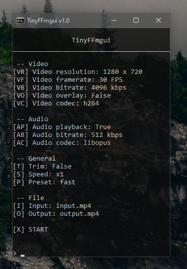

# TinyFFmgui
Yet ***ANOTHER*** Text-based GUI for FFmpeg, like HandBrake, but for little brain people like me. Written in Batch
## Current state (v1.0)
The project isn't finished, but all features work. If you find any error or bug, open a new issue

Currently, a Linux version is in the works. No macOS support is planned, however the Linux version may work.

## Features
- Drag and drop any file into the batch file to open it
    - You can also set a file as a parameter when opening the file
    - By default, if you open a file that way, it will be saved as FF[input]
- Extremely lightweight
- Simple to use and modify
- Simple UI for anyone to understand

## Screenshot

## Planned features
- Linux support
- Console-like commands, instead of submenus
- Drag and drop for selecting an overlay/input/output file inside the script
- Get resolution, bitrate and framerate of the video selected, instead of using defaults
- Crop video
- Custom extra parameters for FFmpeg
- Stream using RTMP
- Record screen

But it might take a long time for me to implement allthat. I will do my best, I promise
